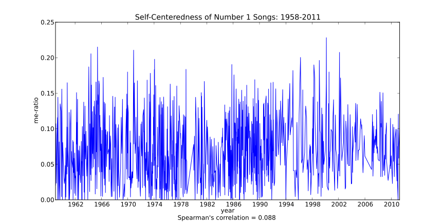

I heard on the radio the other day that Top 40 songs have gotten more self-centered recently. Supposedly, songs in the past used to be about ideas and now they're just all about the person singing the song. The DJ picked a few examples, found that it was the case, and declared this to be true. 

Is it though? It seems like it wouldn't be that hard to test. I plan to do just that in the following manner.

  

1. Get a list of every Billboard #1 single going back as far as possible
2. Get lyrics for each song
3. Count the occurrences of first person personal pronouns (I/me/my/myself/mine) in each song as a measure of self-centeredness.
4. Compare the me-ratio(as I'm calling it) across the decades.
5. ?????
6. Profit?  

That doesn't seem too hard. What I'm calling the me-ratio here is the number of occurrences of 1st person personal pronouns divided by the total number of words in the lyrics. We could question whether the me-ratio is the best metric, but it's at least easily measurable, so I figure it's as good a place as any to start. I don't see how you could sing primarily about yourself without saying words like "I" more than usual. I suppose you could refer to yourself in the third person, but we'll assume this is rare enough to not be much of a factor. I would also argue that any song that includes "I" a lot more than others is inherently pretty self centered. This premise leads to some interesting conclusions, as we'll see.

I only looked at #1 songs to try to take popularity into account. If popularity were ignored, I might find that one era produced a whole lot more selfish songs than another, but if it turns out that nobody liked those songs, I couldn't really claim that pop music as a whole was really more selfish then than at another time.

## Top Ten Most Self-Centered Songs
1. *I Knew I Loved You* by Savage Garden  
    Me-ratio: **22.8%**  
    Date: February 26, 2000

2. *Help Me, Rhonda* by The Beach Boys  
    Me-ratio: **21.5%**  
    Date: May 29, 1965

3. *I Think I Love You* by The Partridge Family  
    Me-ratio: **21.1%**  
    Date: November 21, 1970

4. *Always on Time* by Ja Rule featuring Ashanti  
    Me-ratio: **20.8%**  
    Date: February 23, 2002

5. *Love Me Do* by The Beatles
    Me-ratio: **20.6%**  
    Date: May 30, 1964  

6. *Because You Loved Me* by Céline Dion  
    Me-ratio: **20.0%**  
    Date: March 23, 1996

7. *You're Sixteen* by Ringo Starr  
    Me-ratio: **19.8%**  
    Date: January 26, 1974  

8. *...Baby One More Time* by Britney Spears  
    Me-ratio: **19.6%**  
    Date: January 30, 1999

9. *Take on Me* by a-ha  
    Me-ratio: **19.0%**  
    Date: October 19, 1985  
 
10. *All My Life* by K-Ci and JoJo  
    Me-ratio: **19.0%**  
    Date: April 04, 1998

The top ten at least, don't show any clear prevalence of newer songs than older. Every decade is represented at least once. Indeed, if we look at the data for all of the number one songs since 1958 there doesn't seem to be any evidence of the me-ratio increasing over time.

What does seem to have happened over the past 10 years or so is that there aren't many songs that have a me-ratio of zero, meaning they don't mention the singer at all, but the peaks have also dropped off some. The lyrics refer to the singer more regularly, but the frequency does not peak as highly as it has in the past.

One of the more interesting things I noticed from the top ten is that they mostly appear to be love songs. At first this would appear to be contradictory as a song about how the singer loves someone else shouldn't be considered self centered. But on closer examination I think this makes sense. For example, look at the number one song, *I knew I loved you* by Savage Garden. When you look at the [actual lyrics](http://lyricsfly.com/search/view.php?f9a319f8ed&view=7160&artist=Savage%20Garden&title=I%20Knew%20I%20Loved%20You&hl=%20&opt=title), there's almost no information about the object of the singer's affection. The whole song is about *him* and how he feels about this person he loves, whom he apparently didn't even need to meet before falling completely in love with. This is actually pretty clever because it means the listener can more easily imagine the song is about the object of his or her own affection, but that's somewhat beside the point.

In contrast, one song that I was sure would be at the top was Mims' 2007 hit "This is Why I'm Hot". I mean, what song could be more self centered than that, right? But the me-ratio came in at a relatively tame 13.2%. When you look at [the lyrics](http://lyricsfly.com/search/view.php?0ee40be9e0&view=602237&artist=MIMS&title=This%20Is%20Why%20I'm%20Hot&hl=%20&opt=main) Mims covers a wide range of topics, from cars, to cities to women. Granted, they all relate back to being reasons for why he's hot, but they aren't actually about himself, per se. He also spends part of every chorus explaining not only that he's hot, but that *you*, in fact, are not. So, the song is about the listener, almost as much as the singer, in some respect.

In short, is there a trend in music becoming more self-centered? No, I don't think so. Additionally, the songs that *are* self-centered might not be the ones you think.
  
Code used in gathering this data and performing the analysis can be found in [my bitbucket account](https://bitbucket.org/ggetzie/selfish-music/overview)

*Originally published 2011-06-30 09:06:33*