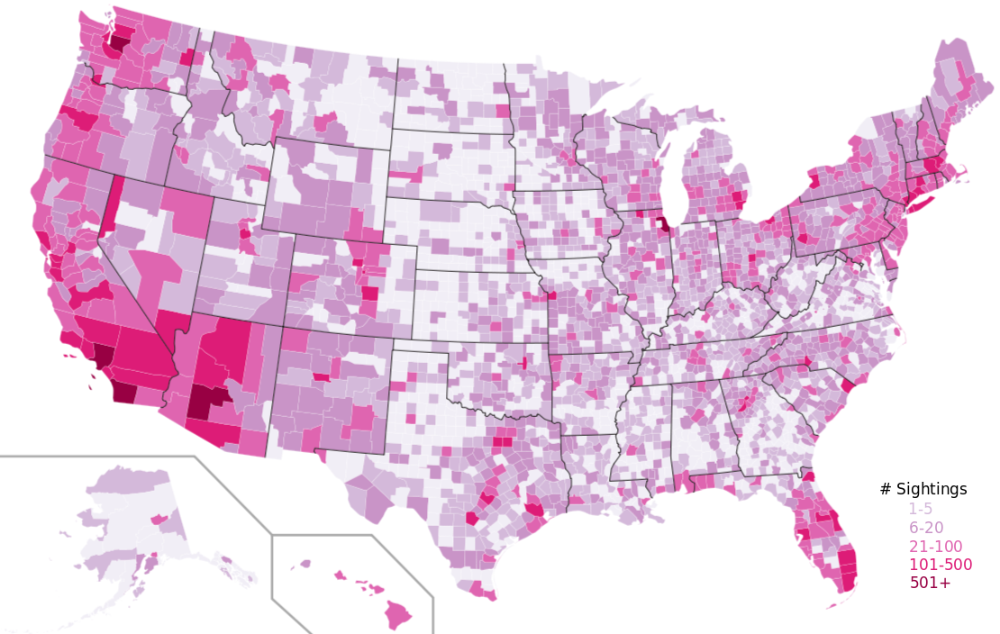

For a while now I've been interested in data mining and
visualization. When someone posted a link to a
[dataset of UFO sighting information](http://www.reddit.com/r/MachineLearning/comments/e81go/ufo_dataset/)
on Reddit, it seemed as good an opportunity as any to jump in and get
my feet wet. There's a lot that could be done with this data, but to
start I decided to make a heat map indicating the number of sightings
by county, throughout the US.

With the help of
[this excellent guide](http://flowingdata.com/2009/11/12/how-to-make-a-us-county-thematic-map-using-free-tools/)
over at Flowing Data, this didn't seem too hard at all. The only
hiccup was that I needed to determine the county and state from the
location field in the data. For the most part, I was able to stitch
together data from several other datasets to resolve the city and
state format of the location field into the county and state
information needed to locate the sighting on the map. Unfortunately,
this narrowed down the data from around 63000 sightings to around 43000. 
For the records where no county and state could be identified,
most were either outside the US, or the city name was not connected to
a county name in any of the datasets I dug up. Obviously, having a
more comprehensive listing of all city names in the US along with the
corresponding county in which they reside would be helpful, but
working with free data, you take what you can get.

Another confounding factor was that the location field was somewhat
noisy and non-uniform. The location might be something like "New York
City, NY" (which would be ideal as this could be split on the comma
into city and state) or it might say something like "Las Vegas (side
of the highway north of town), NV" which fails when simply split on
the comma, so even though that particular city and state would be in
my data, it wouldn't be identified. I was able to improve the rate at
which counties were correctly identified a little by removing all
parenthetical remarks, and special-casing any location that already
had the word "county" in it.

But anyway, without any further ado. Let's have a look at the map. Click on it for a larger version.

I think one of the more interesting things to note is that the
sighting density seems to roughly correlate with population. The
stereotypical idea of a UFO sighting, at least in my mind, is of
someone all alone on a dark road out in the middle of nowhere, and is
also associated with more rural populations. However, it seems like
the more people there are are in a given area, the more likely it is,
rougly, that some of them have seen, or thought they saw, a UFO.

I think there's a good deal of information to be mined. I'd also like
to get around to seeing if there's any particular day of the week or
time of year when sightings are more prevalent. Maybe Friday and
Saturday nights when people are more likely to have been drinking? It
would also be interesting to not if there's any similarities in
description based on sightings that take place around the same time,
or in the same place.

If you're interested, you can find all the datasets I used to patch together the data for this analysis at the following locations:

[UFO Dataset](http://infochimps.com/datasets/d60000-documented-ufo-sightings-with-text-descriptions-and-metad)  
[US towns and zip codes](http://infochimps.com/datasets/united-states-zip-code-database-postal-code-latitudelongitude-ci)  
[US county and FIPS code data](http://www.census.gov/geo/www/gazetteer/places2k.html)  
[Blank USA County map](http://commons.wikimedia.org/wiki/File:USA_Counties_with_FIPS_and_names.svg)  
[All county FIPs codes](http://www.itl.nist.gov/fipspubs/co-codes/states.txt)  

If you'd like to see the code I used to create the map, it's available on my [bitbucket account](https://bitbucket.org/ggetzie/ufo-data-code). The numerical FIPs codes ended up being unnecessary, so it's a little more convoluted than I might like, but it works well enough I suppose.

*Originally published 2011-01-24 06:29:01*